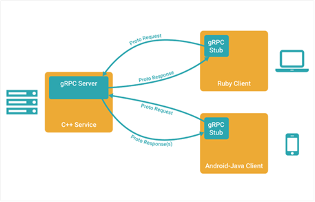
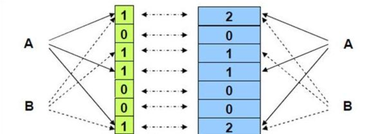
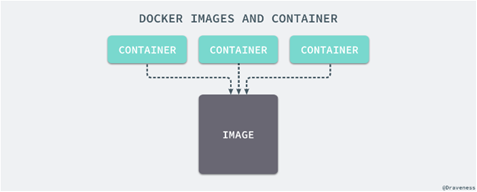
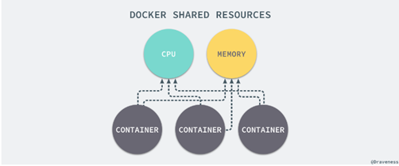
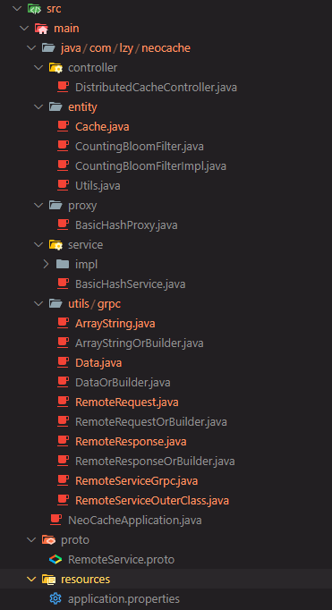
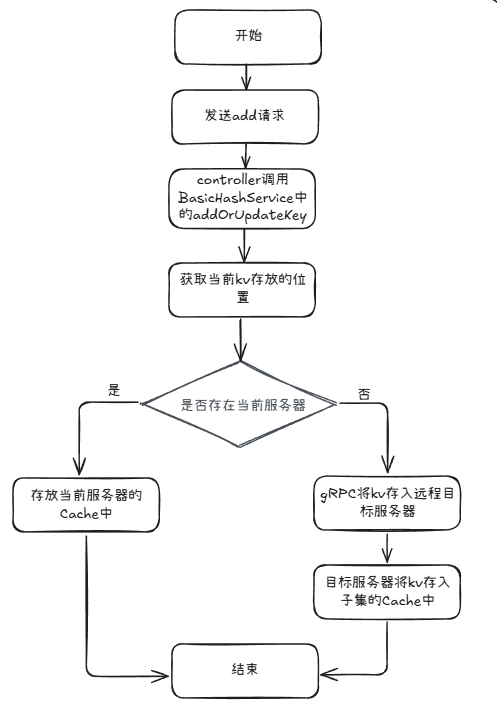
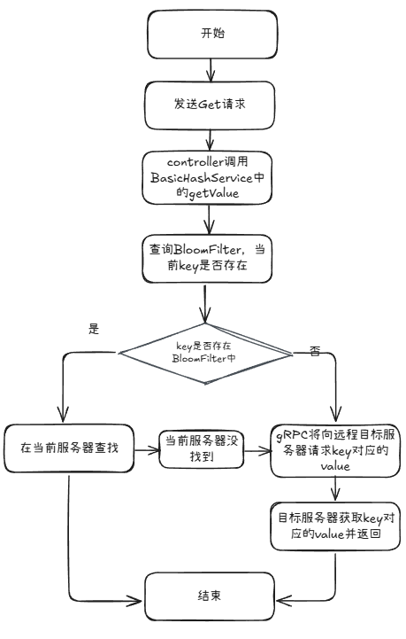
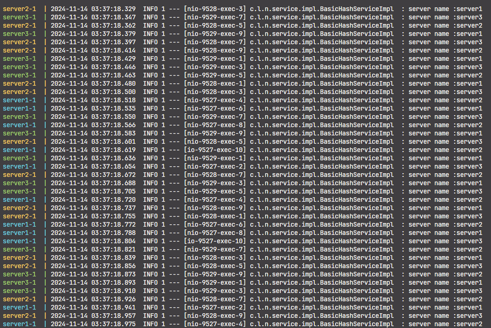
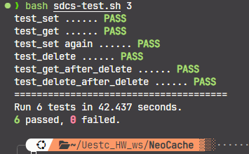
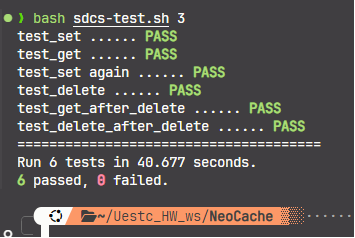

# 分布式缓存系统实验报告

> 课程：分布式系统  
> 学号： 202421080502  
> 姓名：刘芷溢

## 1. 课程名称：

- 分布式系统

## 2. 实验项目名称：

- 分布式缓存系统

## 3. 实验原理：

### 3.1 Grpc 原理：



GRPC（Google Remote Procedure Call）是一种远程过程调用（RPC）框架，由 Google 开发并开源。它的原理基于 HTTP/2 和 Protocol Buffers（Protobufs），提供了一种高效、跨语言的方式来进行分布式系统之间的通信。以下是 gRPC 的工作原理：

1. IDL（Interface Definition Language）： gRPC 使用 Protocol Buffers（Protobufs）来定义服务接口和消息格式。开发人员首先使用 Protobufs 编写服务接口定义文件（.proto 文件），其中包含要执行的方法、消息类型和参数。这个接口定义文件充当服务协议的约定。
2. 代码生成： 使用 protoc 编译器，开发人员将 .proto 文件编译成不同编程语言的代码。这些生成的代码包括客户端和服务器端的存根（Stub）类，用于实际的 RPC 通信。
3. 服务实现： 开发人员创建服务器端应用程序，并实现 gRPC 自动生成的服务接口。这些服务实现类接受客户端的请求，并执行相应的方法。
4. gRPC 通信： 客户端应用程序使用生成的客户端存根类，构建 RPC 请求并将其发送到服务器。通信基于 HTTP/2，因此它允许多路复用，头部压缩，流控制等特性，提供了高效的通信。
5. 序列化和反序列化： 消息在客户端和服务器之间通过二进制格式传输。gRPC 使用 Protocol Buffers 来序列化和反序列化消息，将消息转换为二进制数据以在网络上传输，然后在接收端还原成消息对象。
6. 安全性： gRPC 提供了安全性选项，可以使用 TLS/SSL 进行通信加密，还支持基于 Token 的认证和授权机制，确保通信的安全性。
7. 跨语言支持： 由于 gRPC 的协议和代码生成工具，可以轻松支持多种编程语言。这使得跨语言的分布式系统开发变得更加容易。

### 3.2 布隆过滤器原理

布隆过滤器（Bloom Filter）是一种空间效率极高的概率型数据结构，常用于测试一个元素是否属于一个集合。它通过多个哈希函数将元素映射到一个位数组中，可以在常数时间内进行集合查询操作。

1. 布隆过滤器有一个显著的特点：它可能会出现误判（即报告一个元素存在于集合中，但实际上它并不在），但绝不会漏判（即不可能错过已经加入集合的元素）。因此，布隆过滤器主要用于一些对误判容忍、但对空间要求非常高的场景，例如网络爬虫、缓存、去重等。
2. 布隆过滤器的工作流程
   假设我们有一个布隆过滤器，它使用 k 个哈希函数和一个大小为 m 的位数组（初始化为 0）。每次向布隆过滤器中添加一个元素 x 时，按如下方式处理：

- 计算元素 x 的 k 个哈希值，得到 k 个数组索引值：`hash1(x), hash2(x), ..., hashk(x)`。

- 将这些索引位置的位数组值设置为 1：`bit_array[hash1(x)] = 1, bit_array[hash2(x)] = 1, ..., bit_array[hashk(x)] = 1`。

- 当查询元素 y 是否存在时，计算 y 的 k 个哈希值，如果 `bit_array[hash1(y)] = 1, bit_array[hash2(y)] = 1, ..., bit_array[hashk(y)] = 1`，则返回“存在”；否则返回“不存在”。

3. 我们实际上使用的是布隆过滤器的变种——计数布隆过滤器（Counting Bloom Filter）：通过使用计数器替代位数组，支持删除操作。

   

### 3.3 Docker 原理



Docker 是一种容器化平台，它的原理基于容器技术，允许开发人员将应用程序及其依赖项打包到一个独立的容器中，以确保应用程序能够在不同的环境中一致运行。以下是 Docker 的基本原理：

1. 容器： Docker 使用容器作为封装和分发应用程序的基本单元。一个容器是一个独立的、轻量级的运行时环境，它包括应用程序的代码、运行时库、依赖项和配置。容器是隔离的，意味着一个容器内的应用程序不会影响到其他容器或宿主系统。
2. 镜像： Docker 镜像是容器的模板。它包含了应用程序的文件系统、运行时库和配置。镜像是只读的，可以用于创建容器实例。Docker 镜像可以通过 Dockerfile 定义，这是一个文本文件，描述了如何构建镜像。Docker 镜像可以存储在 Docker Hub 或私有镜像仓库中，以便分享和分发。
3. Docker Engine： Docker Engine 是 Docker 的运行时环境，包括容器运行时、图像构建工具和服务管理。Docker Engine 通过 Docker 客户端与用户交互，可以在本地或远程主机上运行容器。

   

4. 命名空间和控制组： Docker 使用 Linux 内核的命名空间和控制组（cgroup）来提供容器隔离和资源管理。每个容器拥有自己的文件系统、网络命名空间、进程命名空间等，使它们相互隔离，就像独立的虚拟机一样。
5. 网络： Docker 提供了多种网络选项，以便容器之间进行通信和连接到外部网络。这包括桥接网络、主机网络、覆盖网络等。Docker 配置了容器的网络命名空间，使容器可以与宿主系统和其他容器进行通信。
6. 数据管理： Docker 允许容器与宿主系统共享存储卷，也支持将数据卷挂载到容器中。这使得数据可以在容器之间保持一致，并且可以持久化存储。
7. 自动化部署和编排： Docker 可以与容器编排工具（如 Docker Compose、Kubernetes）一起使用，以自动化部署和管理大规模的容器化应用程序。

## 4. 实验目的：

1. 学习 grpc 的原理
2. 学习 docker 的原理
3. 通过分布式缓存系统的设计理解分布式的基础概念

## 5. 实验内容：

1.  Cache 数据以 key-value 形式存储在缓存系统节点内存中（不需要持久化）；
2.  Cache 数据以既定策略（round-robin 或 hash 均可，不做限定）分布在不同节点（不考虑副本存 储）；
3.  服务⾄少启动 3 个节点，不考虑节点动态变化（即运⾏中⽆新节点加⼊，也⽆故障节点退出）；
    - 所有节点均提供 HTTP 访问⼊⼝；
    - 客⼾端读写访问可从任意节点接⼊，每个请求只⽀持⼀个 key 存取；
    - 若数据所在⽬标存储服务器与接⼊服务器不同，则接⼊服务器需通过内部 RPC 向⽬标存储服务器发起相同操作请求，并将⽬标服务器结果返回客⼾端。
4.  HTTP API 约定

    - Content-type: application/json; charset=utf-8
    - 写⼊/更新缓存： POST / 。使⽤ HTTP POST ⽅法，请求发送⾄根路径，请求体为 JSON 格 式的 KV 内容，⽰例如下：

    ```shell
    curl -XPOST -H "Content-type: application/json" http://server1/ -d '{"myname": "电⼦科技⼤学@2024"}'

    curl -XPOST -H "Content-type: application/json" http://server2/ -d '{"tasks": ["task 1", "task 2", "task 3"]}'

    curl -XPOST -H "Content-type: application/json" http://server3/ -d '{"age": 123}'
    ```

    - 读取缓存 GET /{key} 。使⽤ HTTP GET ⽅法， key 直接拼接在根路径之后。为简化程序，对 key 格式不做要求（⾮ URL 安全字符需要进⾏ urlencode）。

      - 正常：返回 HTTP 200，body 为 JSON 格式的 KV 结果；
      - 错误：返回 HTTP 404，body 为空。

      ```shell
      curl http://server2/myname
      {"myname": "电⼦科技⼤学@2024"}

      curl http://server1/tasks
      {"tasks": ["task 1", "task 2", "task 3"]}

      curl http://server1/notexistkey
      # 404, not found 1 2 3 4 5 6 7 8
      ```

    - 删除缓存 DELETE / {key} 。永远返回 HTTP 200，body 为删除的数量。

      ```shell
      curl -XDELETE http://server3/myname
      1

      curl http://server1/myname
      # 404, not found

      curl -XDELETE http://server3/myname
      0
      ```

5.  部署

    - 目的主机需要安装 docker
    - 在项目根目录下执行  
      `docker compose -f compose.yml build baseserver`
      等待构建镜像
    - 启动 server1、2、3:  
      `docker compose -f compose.yml up server1 server2 server3`

      > 可能出现找不到镜像问题，可能是 docker 版本问题，这时需要将 compose.yml 中 `image: neocache-baseserver:latest` 改为 `image: neocache_baseserver:latest`

6.  测试
    - 启动三个 server
    - 执行测试脚本 ：bash sdcs-test.sh

## 6. 实验步骤：

### 6.1 系统架构设计

- 采用 Java 语言开发，使用 springboot 创建一个 web 服务，并根据环境变量启动多个不同属性的实例
- 多个 web 服务实例之间的远程函数调用采用 grpc 实现
- 采用注解式开发，SpingMVC 架构 ，文件夹结构如下

  

### 6.2 分布式策略

- 分布式策略：key mod nodeNum，通过简单的取模运算来实现数据分布，nodeNum 暂时设置为定值 3

### 6.3 计数布隆过滤器

```shell
+--------------------+        +----------------------+
|  元素 x             |        | 哈希函数 (h1, h2, ..., hk) |
|                    |        |    计算哈希值           |
+--------------------+        +----------------------+
          |                             |
          v                             v
  +----------------+          +--------------------+
  | 哈希计算       |----->  | 计数器数组         |
  | h1(x), h2(x),  |          | count[h1(x)],      |
  | ..., hk(x)     |          | count[h2(x)], ...  |
  +----------------+          +--------------------+
          |                             |
          v                             v
+--------------------+        +--------------------+
|  计数器更新      |        |    查询/删除      |
| count[h1(x)] += 1 |        |    查询元素是否在   |
| count[h2(x)] += 1 |        |    如果计数器 > 0   |
| ...                |        | 可能存在，否则确定不在 |
+--------------------+        +--------------------+
```

### 6.4 主要功能的程序流程图

#### dddOrUpdate



#### delete

- 和上面类似

#### get

- 在查找时，首先查找布隆过滤器，但是布隆过滤器存在假阳性；所以在判断当前 key 存在 bloomfilter 中后，仍然需要判断是否 Cache 中存在该 key-value 对



### 6.5 编写 dockerfile 和 compose.yml 文件

- Dockerfile：多阶段构建
  1. 第一阶段根据源码打包成 jar 文件，基于 ubuntu20.04 镜像，安装 jdk17、maven，用 maven 下载依赖并打包成 jar 包。
  2. 第二阶段，基于 ubuntu20.04 镜像，将第一阶段的 jar 复制到新镜像中，安装 jre17。
- Compose.yml:
  1. Basesever: 该服务用于构建镜像
  2. Cachesystemnetwork：用于创建网络服务
  3. server1、server2、server3：启动三个目标服务器，设置所用的镜像名字、服务器的环境变量、设置 http 和 grpc 服务内部外部的端口

## 7.实验数据及结果分析：

### 实验结果

- 用脚本测试
- 程序日志

  > 这里的 Hash 函数用简单的 hashcode()

  

- 脚本结果：

  - 打印日志

    

  - 不打印日志：

    

### 结果分析

- 由于测试插入的 key 基本不同，所有采用对 key 的数值对应的字符串进行简单的 hashcode()处理提升速度，而没有用更加健壮的 SHA 系列函数或者其他哈希函数；
- 可以看到即使采用了最简单的 hash 函数，但是仍然能实现负载均衡；但是对于可能出现的节点故障或增加，这种处理并不能实现很好的负载均衡
- 所有请求都正常处理了，但是 hash 函数用 Stirng 类的 hashcode()，过于简单
- 我们将打印日志和不打印日志的结果进行对比，可以发现在 springboot 中进行日志输出会比不输出日志慢接近 2s，因为我们的输出并没有实现异步输出，所以每次进行函数调用都需要进行日志输出，所以最后我们采用不使用日志输出的版本(**_正常来说 release 版本应该是异步输出日志到文件，这里并没有实现_**)

## 8. 实验结论：

- 我们实现了分布式缓存系统的基本功能，但是对于动态节点进出我们的程序并不能很好地进行负载均衡。
- 用户可以通过向一台服务器发送请求，而目标数据可能在不同的服务器上，分布式缓存系统内部能够 hash 分配策略将数据均匀的分散在三台服务器上，并通过 rpc 的方式调用其他服务器的缓存数据进行增加或删除或查询。
- Docker 的使用，使项目能够快速部署到目标主机上并快速提供服务。

## 9. 总结及心得体会：

- 分布式缓存系统通过 hash 算法将数据均匀分配在多个服务器上，提高了负载均衡和性能。
- Grpc 自动生成代码，大大减少了手动编写 RPC 代码的工作，加速了开发过程。
- Docker 通过容器化技术能够快速将应用程序部署到不同环境中而不必担心依赖和配置问题。

### 实验过程中的问题：

#### docker

- 出现 zlib 版本不支持，是 pigz 包本身的问题，使用源码编译最新的 pigz 包解决

#### gprc

- 在 proto 文件中添加以下代码：
  ```xml
  option java_multiple_files = true;
  option java_package = com.lzy.neocache.utils.grpc";
  ```
  - option java_multiple_files = true; 指示生成的 Java 代码是否将消息和服务定义放入多个文件中。如果设置为 true，则每个消息类型和服务将生成到独立的 Java 文件中。
  - option java_package = com.lzy.neocache.utils.grpc";
    生成的 Java 类将放置在指定的包中，以便组织和命名空间化生成的代码。

#### Docker 镜像

- 编写 dockerfile 文件：
  首先创建一个编译并打包源码的环境，将源码打包成 jar 包，再将 jar 包部署 docker 容器中。
- 编写 compose.yml 文件
  - 为了实现不同容器之间 grpc 的通信，首先创建一个简单的桥接网络，在启动容器时，让这些容器加入相同的网络。
  - 还要配置容器和主机的端口映射，以及程序需要的环境变量
